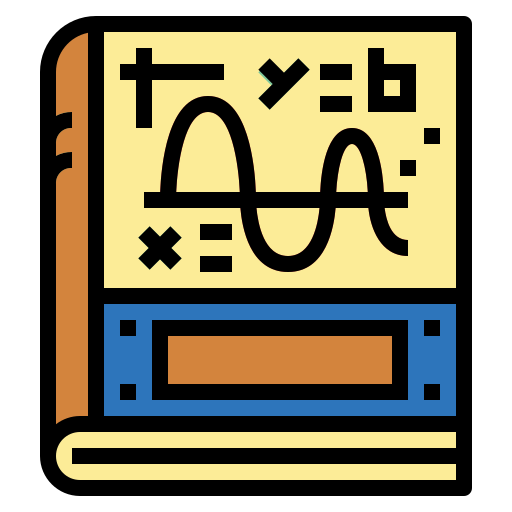

<div id="top"></div>

[![LinkedIn][linkedin-shield]](https://www.linkedin.com/in/dinesh-umasankar-78354b184/)
[](https://app.netlify.com/sites/youthful-turing-596fe3/deploys)


<!-- PROJECT LOGO -->
<br />
<div align="center">
  <a href="https://github.com/dineshUmasankar/calculus-notebook">
    
  </a>

<h3 align="center">Calculus Notebook</h3>

  <p align="center">
    A simple static React Website integrating LaTeX to display various commonly used calculus formulas
    <br />
    <br />
    <a href="https://youthful-turing-596fe3.netlify.app">View Demo</a>
  </p>

  <p align="center">
    <b>Project last modified: September 2020</b>
  </p>
</div>


<!-- ABOUT THE PROJECT -->
## About The Project
This project was made as a quick reference sheet for my calculus notes as I progressed throughout the class during my first semester of college.

![Calculus Notebook Screen Shot][product-screenshot]

<p align="right">(<a href="#top">back to top</a>)</p>


### Built With

* [React.js](https://reactjs.org/)

<p align="right">(<a href="#top">back to top</a>)</p>


<!-- GETTING STARTED -->
## Getting Started

This is an example of how you may give instructions on setting up your project locally.
To get a local copy up and running follow these simple example steps.

### Prerequisites

This is an example of how to list things you need to use the software and how to install them.
* npm
  ```sh
  npm install npm@latest -g
  ```

### Installation

1. Clone the repo
   ```sh
   git clone https://github.com/github_username/repo_name.git
   ```
2. Install NPM packages
   ```sh
   npm install
   ```

<p align="right">(<a href="#top">back to top</a>)</p>


<!-- USAGE EXAMPLES -->
## Usage

1. Within the directory of the project
   ```sh
   npm run start
   ```
This should provide a local running instance of the website which can be referenced as a quick formula sheet.

![Responsive Calculus Notebook][product-responsive-screenshot]

<p align="right">(<a href="#top">back to top</a>)</p>


<!-- LICENSE -->
## License

Distributed under the GNU License. See `LICENSE.txt` for more information.

<p align="right">(<a href="#top">back to top</a>)</p>


<!-- CONTACT -->
## Contact

Dinesh Umasankar - [@DineshUmasankar](https://twitter.com/DineshUmasankar) - [dinesh71uma@gmail.com](mailto:dinesh71uma@gmail.com)

Project Link: [https://github.com/dineshUmasankar/calculus-notebook](https://github.com/dineshUmasankar/calculus-notebook)


<!-- ACKNOWLEDGEMENTS -->
## Acknowledgements

* [Design Inpsired by devhints.io](https://devhints.io/)
* [README Template](https://github.com/othneildrew/Best-README-Template)
* [Icon made by smalllikeart](https://www.flaticon.com/authors/smalllikeart)


<!-- MARKDOWN LINKS & IMAGES -->
<!-- https://www.markdownguide.org/basic-syntax/#reference-style-links -->
[linkedin-shield]: https://img.shields.io/badge/-LinkedIn-black.svg?style=for-the-badge&logo=linkedin&colorB=555
[product-screenshot]: images/preview.png
[product-responsive-screenshot]: images/responsive_preview.png
